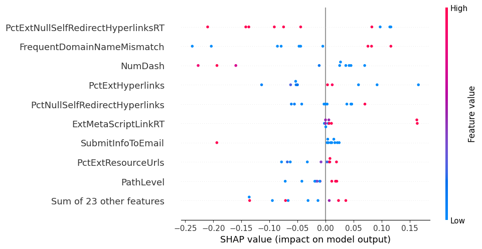

# E2Phish: Explainable Ensemble Machine Learning Model for Enhanced Phishing URL Detection 
This repository contains the code and resources associated with the paper titled **"E2Phish: Explainable Ensemble Machine Learning Model for Enhanced Phishing URL Detection "**, presented at [The 8th edition of the Annual IEEE International Conference on Information Communication Technology (CICT) jointly organized by all CFIllTs, 2024.](https://cict2024.iiita.ac.in/2024/) The study investigates the detection of phishing websites through a combination of machine learning and explainable AI (XAI) techniques, aiming to improve both predictive accuracy and model interpretability.

## Project Overview
Phishing websites pose a serious cybersecurity risk by attempting to steal sensitive information through deception. This study leverages a balanced dataset consisting of 10,000 instances and 50 features, sourced from Kaggle, to develop predictive models for phishing website detection.

1. **Dataset Details**
   - The dataset comprises 10,000 samples with 50 features, including labels indicating phishing or legitimate websites.
   - The data is balanced, ensuring equal representation of both phishing and legitimate cases.[click here to download dataset](https://www.kaggle.com/code/fadilparves/pishing-detection-using-machine-learning/comments)
2. **Feature Selection**
   - The Mutual Information (MI) technique was applied to select the most informative features.
   - This process reduced the dataset to 32 significant features, enhancing predictive performance.
3. **Machine Learning Techniques**
   - **Base Classifiers**: Decision Tree (DT), Logistic Regression (LR), Naive Bayes (NB), and Support Vector Machine (SVM).
   - **Stacking Ensemble Approach**: A multi-level stacking ensemble model was developed:
     - **Level 0 (Base Learners)**: Naive Bayes, SVM, and Decision Tree.
     - **Level 1 (Meta-Learner)**: Logistic Regression served as the meta-classifier to aggregate base learner predictions.
   - The ensemble approach was designed to harness the strengths of multiple algorithms, improving overall model performance.
4. **Evaluation Metrics**
   - The stacking ensemble achieved superior results across all key evaluation metrics:
     - **Accuracy**: 97%
     - **Precision**: 96%
     - **Recall**: 98%
     - **F1 Score**: 97%
   - Comparative evaluations demonstrated the ensemble's outperformance over individual classifiers and alternative ensemble methods (soft and hard voting).
5. **Explainable AI (XAI) Integration**
   - XAI techniques, including SHAP, LIME, and Partial Dependence Plots (PDP), were applied to the best-performing model to enhance interpretability.
   - These tools provided insights into feature contributions and model decision-making processes (fig.1).
<p align="center">
  
  <br>
  <em>Figure 1: SHAP's Beeswarm Plot </em>
</p>


## Code Availability
All the code required for this project is made available in the same repository.

## Results Summary
The experimental results highlight the effectiveness of the stacking ensemble approach, achieving higher accuracy and other metrics compared to individual models and voting-based ensembles. The use of XAI techniques provided meaningful insights into the factors influencing model predictions, supporting the decision-making process in phishing detection.

## Citation
If you utilize this repository for academic or research purposes, please cite our work as follows:

```plaintext
@conference{
  title={E2Phish: Explainable Ensemble Machine Learning Model for Enhanced Phishing URL Detection },
  author={Tejas Kalal et al.},
  booktitle={Proceedings of The 8th edition of the Annual IEEE International Conference on Information Communication Technology (CICT)},
  year={2024}
}
```

## Acknowledgments
- The [Kaggle](https://www.kaggle.com) community for providing the dataset.
- All contributors to this project for their valuable inputs.
- The organizers of IEEE International Conference on Information Communication Technology (CICT) for providing a platform to present this research.
